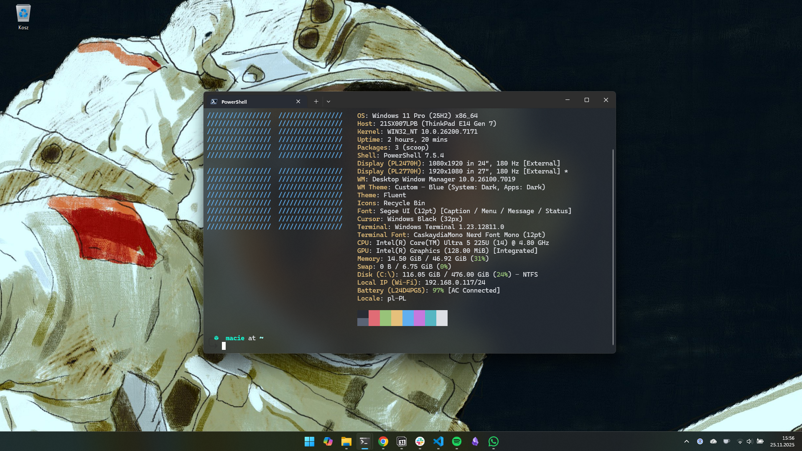

# Opinionated Windows 11 Setup



Who said Windows 11 can't have dotfiles? Who said you can't have a proper terminal with fuzzy finder, starship, fastfetch, ffmpeg, and all the good stuff?

Nobody. That's who.

## Why This Exists

This script is for people like me—people stuck on Windows for reasons beyond their control. Maybe it's your company's MS Office infrastructure. Maybe it's security policies. Maybe it's just... work.

But you still want a properly configured system. You want to code in Node.js or Python without friction. You want those Linux niceties: beautiful terminal prompts, modern CLI tools, `neovim` with LazyVim, and all that good stuff.

I got tired of the Windows setup dance—clicking through installers, downloading files one by one, configuring settings manually. It's absurdly tedious compared to Linux. So I made this: **one command to get everything set up**.

**Important:** You won't find window manager wannabes like GlazeWM here trying to be "almost as good as Hyprland." Let's not kid ourselves—this is still Windows, with all its quirks. But it's Windows with way more advantages than a typical installation.

## 🚀 Quick Start

### One Command, That's It

Open PowerShell as Administrator:

```powershell
irm https://raw.githubusercontent.com/szamski/Omawin/main/setup.ps1 | iex
```

The script will:
1. Clone itself to your machine
2. Show you an interactive menu
3. Let you choose what to install
4. Get out of your way

**Note:** You need Git installed. If you don't have it, the script will tell you what to do.

### Or Clone First (If You're That Type)

```powershell
git clone https://github.com/szamski/Omawin.git
cd Omawin
.\setup.ps1
```

## ✨ What You Get

### 🛠️ Development Environment
- **Git, Node.js, Python 3.13, PowerShell 7** - the usual suspects
- **VS Code** - because you're probably using it anyway
- **Docker Desktop** - containers on Windows, surprisingly decent
- **WSL 2 with Ubuntu** - a real Linux terminal when you need it
- **Neovim** - for the vim enthusiasts
- **FFmpeg, cURL** - the tools you actually use

### 🎨 Terminal That Doesn't Suck
- **Windows Terminal** - Microsoft finally got it right
- **Starship** - beautiful, fast shell prompt with Git integration
- **CaskaydiaCove Nerd Font** - icons and ligatures
- **PowerShell Profile** - pre-configured with 30+ aliases and functions

### ⚡ Modern CLI Tools (via Scoop)
- **bat** - `cat` with syntax highlighting and Git integration
- **eza** - modern `ls` with icons, colors, and Git status
- **zoxide** - smart `cd` that learns your habits
- **btop** - beautiful, interactive system monitor
- **lazygit** - terminal UI for Git (better than `git` alone)
- **fzf** - fuzzy finder for everything
- **7zip, grep, make, gcc, tree-sitter** - development essentials

### 📱 Apps I Actually Use
- **Claude** - AI that helps you code
- **Perplexity** - AI-powered search
- **Obsidian** - notes that make sense
- **1Password** - because password123 isn't cutting it
- **Chrome** - yeah, yeah, I know
- **Discord, Slack, Zoom, Lark, WhatsApp** - work and play
- **Notion Calendar** - calendar that actually works
- **Spotify** - for the coding soundtrack
- **LocalSend** - AirDrop for everything
- **PowerToys** - Windows utilities that should be built-in
- **Steam, SteelSeries GG** - because work-life balance

### 🎨 Creative Stuff
- **Affinity Suite** - Photoshop but you actually own it
- **Bambu Studio** - if you're into 3D printing
- **OBS Studio** - streaming and recording
- **PDFgear** - PDF reader and editor

### 🔒 Privacy & Security (52 Settings)
- Disable telemetry and diagnostic data collection
- Turn off advertising ID and activity tracking
- Disable Cortana and web search in Start Menu
- Block location tracking and cloud content suggestions
- Disable Windows Error Reporting
- Stop scheduled telemetry tasks
- Configure app privacy settings
- Disable OneDrive file sync (optional)
- Keep Windows Security and Updates enabled

### ⚙️ System Tweaks That Should Be Default
- Show file extensions (how is this not default?)
- Show hidden files (same question)
- Dark mode everything
- Kill the animations (performance > pretty)
- Hide the taskbar junk you never use
- Open Explorer to "This PC" instead of Quick Access
- Disable recent documents tracking

### 🖥️ Smart Driver Detection
The script actually looks at your hardware and installs the right stuff:
- NVIDIA/AMD/Intel graphics drivers
- Manufacturer tools (Lenovo, Dell, HP)
- Audio drivers (including Intel SST)
- Network adapters (WiFi, Ethernet)
- Chipset drivers
- Everything else through Windows Update

### 🐙 Git & GitHub Configuration
- Interactive setup for user name and email
- SSH key generation for GitHub
- GitHub CLI authentication (`gh auth login`)
- Optimized Git settings (autocrlf, editor, credential manager)
- VS Code as default Git editor
- GPG signing with SSH keys

## 📦 What Gets Installed

### Software Packages (35 total)
- **Development**: Git, Node.js, VS Code, Docker, Python, FFmpeg, cURL, Neovim, PowerShell 7
- **Terminal**: Windows Terminal, Starship
- **Productivity**: Claude, Perplexity, PDFgear, Obsidian, 1Password, Chrome, Notion Calendar
- **Communication**: Discord, Slack, Zoom, Lark, WhatsApp
- **Creative**: Affinity, Bambu Studio, OBS Studio
- **Utilities**: LocalSend, Spotify, NordVPN, PowerToys, fastfetch, fzf
- **Gaming**: Steam, SteelSeries GG

### Scoop Packages (11 total)
- **Modern CLI**: bat, eza, zoxide, btop, lazygit
- **Development**: gcc, make, tree-sitter, grep
- **Utilities**: 7zip

## 🎯 Usage Modes

### Interactive Menu (Default)
Just run `.\setup.ps1` and pick what you want:
- **Full Install** - everything (recommended for new machines)
- **Dry-Run** - see what would happen without making changes
- **Custom** - pick and choose modules
- **Quick** - skip drivers and WSL (faster for testing)

### Command Line (For Scripts)
```powershell
# Preview without changing anything
.\setup.ps1 -DryRun

# Skip specific modules
.\setup.ps1 -SkipWSL -SkipDrivers -SkipGitConfig

# Just install software, no system tweaks
.\setup.ps1 -SkipSystemConfig -SkipTelemetry

# Skip everything except software and environment
.\setup.ps1 -SkipSystemConfig -SkipDrivers -SkipWSL -SkipTelemetry -SkipPowerShell

# Go full auto (no menu)
.\setup.ps1 -NoMenu
```

### Available Skip Flags
- `-SkipSoftware` - Skip winget package installation
- `-SkipSystemConfig` - Skip registry tweaks and system settings
- `-SkipEnvironment` - Skip environment variables setup
- `-SkipDrivers` - Skip hardware detection and driver installation
- `-SkipWSL` - Skip WSL and Ubuntu installation
- `-SkipTelemetry` - Skip privacy and telemetry disabling
- `-SkipPowerShell` - Skip PowerShell profile configuration
- `-SkipGitConfig` - Skip Git and GitHub setup
- `-DryRun` - Preview mode (no changes made)
- `-NoMenu` - Skip interactive menu

## 📋 Installation Modules

The setup process consists of 11 independent modules:

1. **Software Installation** - Install 35 packages via winget/Microsoft Store
2. **System Configuration** - Apply 17 registry tweaks for better UX
3. **Privacy & Telemetry** - Disable 52 tracking and telemetry settings
4. **Environment Variables** - Configure PATH and development environment
5. **PowerShell Profile** - Set up Starship, aliases, and PSReadLine
6. **Scoop & Dev Tools** - Install 11 modern CLI tools
7. **Nerd Fonts** - Install CaskaydiaCove font for terminal icons
8. **Hardware Detection** - Detect CPU, GPU, audio, network hardware
9. **Driver Installation** - Install manufacturer-specific drivers
10. **WSL Installation** - Enable WSL2 and install Ubuntu
11. **Git & GitHub Config** - Set up Git credentials and SSH keys

## 🔧 After Installation

1. **Restart** - yeah, it's Windows
2. **Open Ubuntu** from Start - set up your Linux username
3. **Reload PowerShell** - profile is already configured with Starship
4. **Test your new tools**:
   ```powershell
   # Try the new aliases
   sysinfo              # System information
   gs                   # git status
   ll                   # eza -la (pretty ls)
   cat file.txt         # bat (syntax highlighted)

   # Navigate smarter
   z projects           # zoxide (smart cd)

   # Git with style
   lazygit              # Terminal UI for Git

   # Monitor your system
   btop                 # Beautiful system monitor
   ```
5. **Sign into stuff** - 1Password, Chrome, GitHub CLI, etc.

## 🎨 Customization

### Change Software List
Edit `config/software.json` to add/remove packages.

Find package IDs:
```powershell
# Search winget
winget search "whatever you want"

# Search Microsoft Store
winget search "app name" --source msstore

# Search Scoop
scoop search "package"
```

### Modify System Settings
Edit `scripts/configure-system.ps1` for different registry tweaks.

### Adjust Privacy Settings
Edit `scripts/disable-telemetry.ps1` to enable/disable specific settings.

### Customize PowerShell Profile
After installation, edit your profile:
```powershell
code $PROFILE
```

### Modify Starship Prompt
Edit `~/.config/starship.toml` to customize your prompt.

This is your machine. Make it yours.

## 🐛 Troubleshooting

**Winget not found?**
Install "App Installer" from Microsoft Store. Restart PowerShell.

**Permission denied?**
Run PowerShell as Administrator. Right-click, "Run as Administrator."

**Execution policy blocking?**
```powershell
Set-ExecutionPolicy -ExecutionPolicy RemoteSigned -Scope CurrentUser
```

**WSL installation failed?**
Enable Virtualization in BIOS. Some features require a restart.

**Scoop installation issues?**
Check execution policy and ensure you have internet access.

**Git SSH key not working?**
Add the generated key to GitHub: https://github.com/settings/keys

## 📁 Project Structure

```
Omawin/
├── setup.ps1                          # Main orchestrator script
├── config/
│   └── software.json                  # Software packages configuration
├── scripts/
│   ├── common-helpers.ps1             # Shared utility functions
│   ├── install-software.ps1           # Winget/msstore automation
│   ├── configure-system.ps1           # Registry and system tweaks
│   ├── disable-telemetry.ps1          # Privacy and telemetry settings
│   ├── setup-env.ps1                  # Environment variables
│   ├── configure-powershell.ps1       # PowerShell profile setup
│   ├── install-scoop.ps1              # Scoop package manager
│   ├── install-fonts.ps1              # Nerd Fonts installation
│   ├── detect-hardware.ps1            # Hardware detection
│   ├── install-drivers.ps1            # Driver installation
│   ├── enable-wsl.ps1                 # WSL and Ubuntu setup
│   └── configure-git.ps1              # Git and GitHub configuration
├── assets/
│   └── fastfetch.png                  # Screenshot
└── README.md
```

## 🤝 Contributing

This is my personal setup, but if you want to fork it and make it yours—go for it. That's the point.

If you find bugs or have improvements, feel free to open an issue or PR.

## 📝 License

Do whatever you want with this. It's just scripts.

---

**Now go make Windows actually usable.** 🚀

**Powered by:** PowerShell, winget, Scoop, and spite for clicking through installers.
