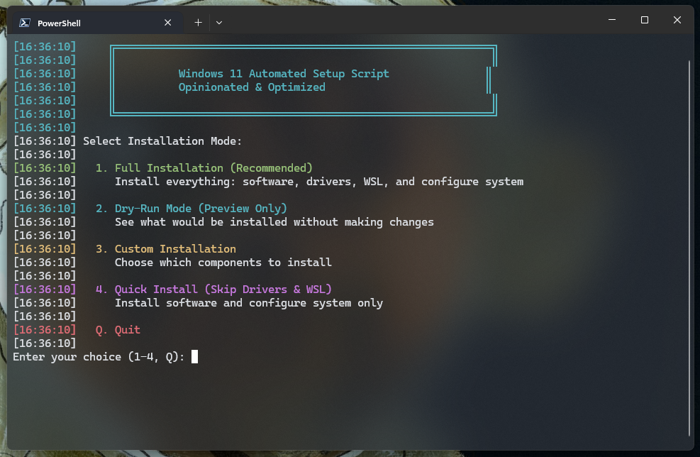

# Opinionated Windows 11 Setup


Who said Windows 11 can't have dotfiles? Who said you can't have a proper terminal with fuzzy finder, starship, fastfetch, ffmpeg, and all the good stuff?

Nobody. That's who.

## Why This Exists

This script is for people like me—people stuck on Windows for reasons beyond their control. Maybe it's your company's MS Office infrastructure. Maybe it's security policies. Maybe it's just... work.

But you still want a properly configured system. You want to code in Node.js or Python without friction. You want those Linux niceties: beautiful terminal prompts, `fzf`, `neovim` with LazyVim, and all that good stuff.

I got tired of the Windows setup dance—clicking through installers, downloading files one by one, configuring settings manually. It's absurdly tedious compared to Linux. So I made this: **one command to get everything set up**.

**Important:** You won't find window manager wannabes like GlazeWM here trying to be "almost as good as Hyprland." Let's not kid ourselves—this is still Windows, with all its quirks. But it's Windows with way more advantages than a typical installation.

## 🚀 Quick Start



### One Command, That's It

Open PowerShell as Administrator:

```powershell
irm https://raw.githubusercontent.com/szamski/opinionated_windows11/main/setup.ps1 | iex
```

The script will:
1. Clone itself to your machine
2. Show you an interactive menu
3. Let you choose what to install
4. Get out of your way

**Note:** You need Git installed. If you don't have it, the script will tell you what to do.

### Or Clone First (If You're That Type)

```powershell
git clone https://github.com/szamski/opinionated_windows11.git
cd opinionated_windows11
.\setup.ps1
```

## What You Get

### Development Environment
- **Git, Node.js, Python 3.13** - the usual suspects
- **VS Code** - because you're probably using it anyway
- **Docker Desktop** - containers on Windows, surprisingly decent
- **WSL 2 with Ubuntu** - a real Linux terminal when you need it
- **FFmpeg, cURL** - the tools you actually use

### Terminal That Doesn't Suck
- **Windows Terminal** - finally
- **Starship** - beautiful, fast shell prompt
- **fzf** - fuzzy finder (install separately in WSL, works like a charm)
- **neovim** - (you can add LazyVim yourself, I'm not that opinionated)

### Apps I Actually Use
- **Claude** - AI that helps you code
- **Obsidian** - notes that make sense
- **1Password** - because password123 isn't cutting it
- **Chrome** - yeah, yeah, I know
- **Discord, Slack, Zoom, Lark** - work and play
- **Spotify** - for the coding soundtrack
- **Steam** - because work-life balance

### Creative Stuff
- **Affinity Suite** - Photoshop but you actually own it
- **Bambu Studio** - if you're into 3D printing

### System Tweaks That Should Be Default
- Show file extensions (how is this not default?)
- Show hidden files (same question)
- Dark mode everything
- Kill the animations (performance > pretty)
- Hide the taskbar junk you never use
- Disable tracking nonsense

### Smart Driver Detection
The script actually looks at your hardware and installs the right stuff:
- NVIDIA/AMD/Intel graphics drivers
- Manufacturer tools (Lenovo, Dell, HP)
- Audio drivers
- Network adapters
- Everything else through Windows Update

## 🎯 Usage Modes

### Interactive Menu (Default)
Just run `.\setup.ps1` and pick what you want:
- **Full Install** - everything
- **Dry-Run** - see what would happen
- **Custom** - pick and choose
- **Quick** - skip drivers and WSL

### Command Line (For Scripts)
```powershell
# Preview without changing anything
.\setup.ps1 -DryRun

# Skip stuff you don't need
.\setup.ps1 -SkipWSL -SkipDrivers

# Just install software, no system tweaks
.\setup.ps1 -SkipSystemConfig

# Go full auto
.\setup.ps1 -NoMenu
```

## After Installation

1. **Restart** - yeah, it's Windows
2. **Open Ubuntu** from Start - set up your Linux username
3. **Configure Starship** in PowerShell (add to `$PROFILE`):
   ```powershell
   Invoke-Expression (&starship init powershell)
   ```
4. **Set up Git**:
   ```bash
   git config --global user.name "Your Name"
   git config --global user.email "your@email.com"
   ```
5. **Sign into stuff** - 1Password, Chrome, etc.

## Customization

Want different software? Edit `config/software.json`.

Find package IDs:
```powershell
winget search "whatever you want"
```

System settings not to your taste? Edit `scripts/configure-system.ps1`.

This is your machine. Make it yours.

## Troubleshooting

**Winget not found?**  
Install "App Installer" from Microsoft Store. Restart PowerShell.

**Permission denied?**  
Run PowerShell as Administrator. Right-click, "Run as Administrator."

**Execution policy blocking?**  
```powershell
Set-ExecutionPolicy -ExecutionPolicy RemoteSigned -Scope CurrentUser
```

**WSL needs restart?**  
Some Windows features require it. Just restart.

## Project Structure

```
opinionated_windows11/
├── setup.ps1                    # The main script
├── config/
│   └── software.json           # What gets installed
├── scripts/
│   ├── install-software.ps1    # Winget automation
│   ├── configure-system.ps1    # Registry tweaks
│   ├── setup-env.ps1           # PATH and environment
│   ├── detect-hardware.ps1     # Hardware detection
│   ├── install-drivers.ps1     # Driver installation
│   └── enable-wsl.ps1          # WSL setup
└── README.md
```

## Contributing

This is my personal setup, but if you want to fork it and make it yours—go for it. That's the point.

---

**Now go make Windows actually usable.** 🚀
